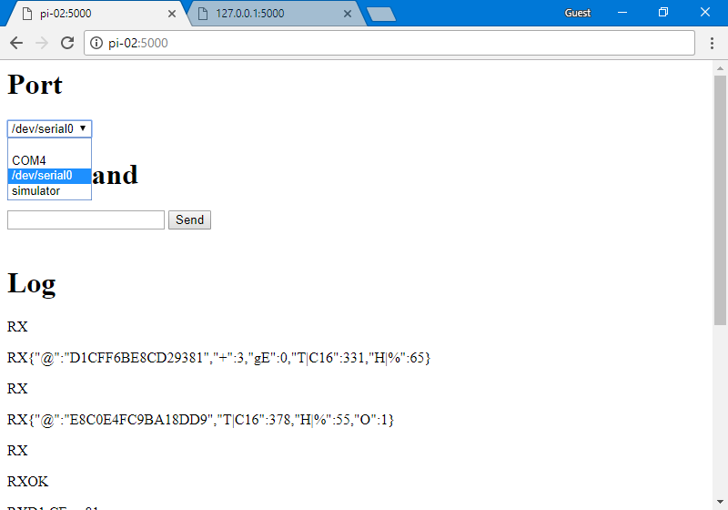
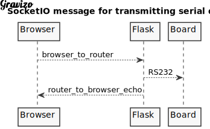
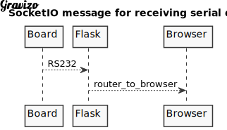

# OTPiWebConsole

An asynchronous web interface to probe a REV11 stats hub when directly connected to a Raspberry Pi

Note that the content of this project is available under a permissive licence, Apache 2.0 or (Solderpad 0.51 for hardware elements) unless otherwise stated, and is provided supplied AS-IS with no warranties of any kind.

## Overview

Built on [Python 3](https://www.python.org/download/releases/3.0/), [Flask](http://flask.pocoo.org/) and [SocketIO](https://socket.io/) for RaspberryPi or Windows

### Usage

Connect an OpentTRV device via serial cable to a RaspberryPi or PC, then run app.py from the Pi/PC.  app.py starts the Flask web server, allowing you to interrogate the OpenTRV device from a browser.

### Transport

## Setup

1. [Reconfigure serial port UART0 on the Pi](#reconfigure-serial-port-uart0-on-the-pi)
2. [Install prerequisite components](#Install-prerequisite-components)

## Reconfigure serial port UART0 on the Pi

Before we can access serial port UART0 from our code, we need reconfigure the Pi so it does not claim UART0 at boot up as a serial console shell.

See section [RaspberryPi Serial - Setting up the Pi](https://github.com/opentrv/OTWiki/wiki/RaspberryPi-Serial#setting-up-the-pi) in the wiki.

## Install prerequisite components

Before the web server can be run, we need to ensure that several components are installed, including

* [Python 3](https://www.python.org/download/releases/3.0/)
* [Flask](http://flask.pocoo.org/) micro web server

These will be installed for you, if you run the following command on your Pi:

`bash install.sh`

This can take several minutes.

To run the web app:

`bash run.sh`
